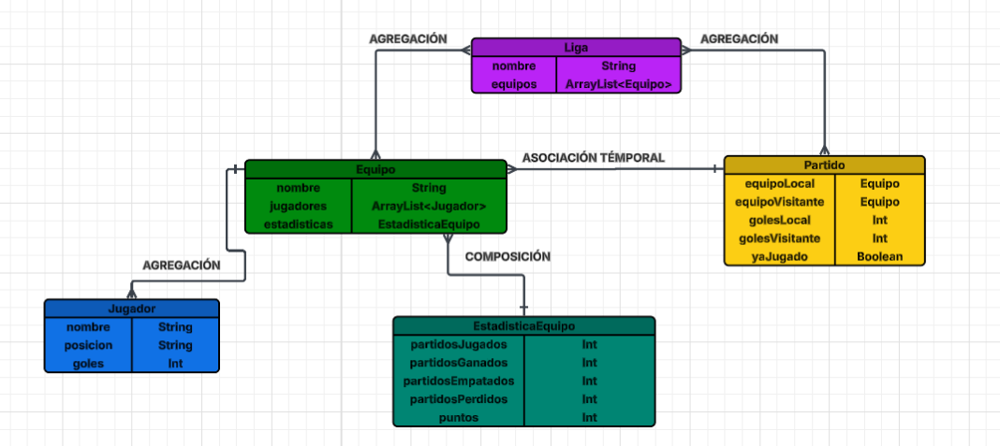

# Sistema de Gestión de la Liga Argentina de Fútbol

## Descripción General

Este proyecto implementa un **Sistema de Gestión de la Liga Argentina de Fútbol** en Java, siguiendo los principios de la Programación Orientada a Objetos (POO). El sistema permite crear equipos, administrar jugadores, simular partidos y visualizar la tabla de posiciones en tiempo real.

---

## Explicación Técnica de las Clases

### 1. **Clase `Jugador`**

**Responsabilidad:** Representar a un jugador individual de fútbol.

**Atributos:**
- `nombre` (String): Nombre del jugador
- `posicion` (String): Posición del jugador en el terreno (ej: Delantero, Mediocampista, Defensa, Portero)
- `goles` (int): Cantidad de goles marcados (inicializado en 0)

**Métodos principales:**
- Constructores y getters/setters para encapsulamiento
- `agregarGoles(int golesAñadidos)`: Incrementa los goles del jugador (con validación)
- `toString()`: Retorna una representación formateada del jugador

**Encapsulamiento:**
Todos los atributos son `private`, con acceso controlado mediante getters y setters. Esto garantiza la integridad de los datos.

---

### 2. **Clase `EstadisticaEquipo`**

**Responsabilidad:** Mantener y actualizar las estadísticas de un equipo.

**Atributos:**
- `partidosJugados` (int): Total de partidos disputados
- `partidosGanados` (int): Partidos ganados
- `partidosEmpatados` (int): Partidos empatados
- `partidosPerdidos` (int): Partidos perdidos
- `puntos` (int): Puntos acumulados

**Métodos principales:**
- `actualizarEstadisticas(int golesAFavor, int golesEnContra)`: Actualiza los valores de estadísticas según el resultado del partido
  - **Lógica:** 3 puntos por victoria, 1 por empate, 0 por derrota (sistema tradicional de fútbol)
- `toString()`: Formatea las estadísticas para visualización

**Patrón:** Esta clase implementa el concepto de **Composición**, ya que un equipo **siempre** contiene exactamente una instancia de `EstadisticaEquipo`. Sin equipo, no hay estadísticas.

---

### 3. **Clase `Equipo`**

**Responsabilidad:** Representar un equipo de fútbol con sus jugadores y estadísticas.

**Atributos:**
- `nombre` (String): Nombre del equipo
- `jugadores` (ArrayList<Jugador>): Lista de jugadores del equipo
- `estadisticas` (EstadisticaEquipo): Objeto que mantiene las estadísticas del equipo

**Relaciones OOP:**

1. **Composición con `EstadisticaEquipo`:**
   - La instancia de `EstadisticaEquipo` se crea automáticamente en el constructor del equipo
   - Tiene un ciclo de vida dependiente: si el equipo se elimina, las estadísticas se eliminan
   - Relación de uno-a-uno

2. **Agregación con `Jugador`:**
   - Los jugadores son agregados al equipo mediante `agregarJugador()`
   - Los jugadores pueden existir sin el equipo (son objetos independientes)
   - La vida de los jugadores no depende de la vida del equipo
   - Relación de uno-a-muchos

**Métodos principales:**
- `agregarJugador(Jugador jugador)`: Agrega un jugador al equipo (con validación de duplicados)
- `eliminarJugador(Jugador jugador)`: Elimina un jugador del equipo
- `mostrarPlantel()`: Muestra todos los jugadores del equipo
- `cantidadJugadores()`: Retorna la cantidad de jugadores

---

### 4. **Clase `Partido`**

**Responsabilidad:** Representar un encuentro entre dos equipos y gestionar su resultado.

**Atributos:**
- `equipoLocal` (Equipo): Equipo que juega como local
- `equipoVisitante` (Equipo): Equipo que juega como visitante
- `golesLocal` (int): Goles marcados por el equipo local
- `golesVisitante` (int): Goles marcados por el equipo visitante
- `yaJugado` (boolean): Indicador para evitar repetir un partido

**Relaciones OOP:**

**Asociación con `Equipo`:**
- Ambos equipos están **asociados** al partido pero son objetos independientes
- Los equipos pueden existir sin partidos
- Es una relación temporal y de muchos-a-muchos (un equipo puede jugar muchos partidos)

**Validaciones:**
- En el constructor valida que:
  - Los equipos no sean nulos
  - No sea el mismo equipo como local y visitante (evita casos inválidos)
- En el método `jugar()`:
  - Valida que los goles sean no-negativos
  - Impide re-jugar un partido ya jugado

**Métodos principales:**
- `jugar(int golesLocal, int golesVisitante)`: Ejecuta el partido
  - Actualiza las estadísticas de ambos equipos llamando al método correspondiente
  - Muestra el resultado de forma amigable
- `mostrarResultado()`: Exhibe el resultado del partido en consola

---

### 5. **Clase `Liga`**

**Responsabilidad:** Gestionar el conjunto de equipos y coordinar la competición.

**Atributos:**
- `nombre` (String): Nombre de la liga
- `equipos` (ArrayList<Equipo>): Lista de equipos participantes

**Métodos principales:**
- `agregarEquipo(Equipo equipo)`: Agrega un equipo a la liga
  - Valida que el equipo no sea nulo
  - Valida que no exista otro equipo con el mismo nombre
- `mostrarTabla()`: Exhibe la tabla de posiciones ordenada por puntos (descendente)
  - Formato de tabla estructurada con caracteres Unicode
  - Muestra: posición, equipo, partidos jugados/ganados/empatados/perdidos, puntos y jugadores
- `cantidadEquipos()`: Retorna la cantidad de equipos

---

### 6. **Clase `Main`**

**Responsabilidad:** Orquestar la aplicación y proporcionar interfaz de usuario.

**Características:**

1. **Inicialización de datos (`inicializarDatos()`):**
   - Crea 3 equipos de ejemplo: Boca Juniors, River Plate e Independiente
   - Agrega jugadores a cada equipo
   - Simula 3 partidos para demostrar el funcionamiento

2. **Menú interactivo (`mostrarMenu()`):**
   - Opción 1: Ver tabla de posiciones
   - Opción 2: Ver plantel de un equipo
   - Opción 3: Jugar un partido (usuario ingresa goles)
   - Opción 4: Agregar un nuevo equipo
   - Opción 5: Agregar jugador a un equipo
   - Opción 6: Ver información completa de un equipo
   - Opción 7: Salir

3. **Gestión de entrada:**
   - Validación de entrada del usuario
   - Manejo de excepciones `InputMismatchException`
   - Selección de equipos mediante menú numérico

---

## Relaciones entre Clases (Diagrama Conceptual)





+	Liga ↔ Equipo (1:N): Una liga contiene muchos equipos; un equipo pertenece a una liga.
+	Equipo ↔ Jugador (1:N): Un equipo tiene una lista de muchos jugadores; un jugador pertenece a un solo equipo a la vez.
+	Equipo ↔ EstadisticaEquipo (1:1): Cada equipo posee un único registro de estadísticas vinculado exclusivamente a él.


---

## Principios OOP Aplicados

### 1. **Encapsulamiento**
- Todos los atributos son `private`
- Acceso controlado mediante métodos `public` (getters/setters)


### 2. **Abstracción**
- Cada clase representa un concepto del dominio (Jugador, Equipo, Liga, etc.)
- Los detalles complejos se ocultan dentro de las clases
- La interfaz es simple y clara

### 3. **Composición**
- `Equipo` **contiene** `EstadisticaEquipo` (relación fuerte)
- El ciclo de vida de las estadísticas está vinculado al equipo
- Al crear un equipo, automáticamente se crean sus estadísticas

### 4. **Agregación**
- `Equipo` **contiene** una colección de `Jugador` (relación débil)
- Los jugadores pueden existir independientemente del equipo
- Permite flexibilidad y reutilización de objetos

### 5. **Asociación**
- `Partido` **relaciona** dos equipos (`Equipo`)
- La relación es temporal (mientras se juega el partido)
- Los equipos no dependen del partido para existir

### 6. **Polimorfismo**
- Uso de `Comparator` anónimo para ordenar equipos por puntos
- Método `toString()` implementado en todas las clases

---

## Flujo de Ejecución Principal

1. **Main** se ejecuta y crea una **Liga**
2. Se crean 3 **Equipos** y se agregan a la **Liga**
3. Se crean **Jugadores** y se agregan a cada **Equipo**
4. Se crean **Partidos** entre equipos
5. Se ejecuta `jugar()`, que actualiza las **EstadisticaEquipo** de ambos equipos
6. Se muestra la **tabla de posiciones** ordenada por puntos
7. Se ofrece un menú interactivo para continuar jugando más partidos

---

## Validaciones Implementadas

✓ No se puede jugar un partido entre el mismo equipo (local y visitante)
✓ No se pueden asignar goles negativos
✓ No se puede re-jugar un partido ya jugado
✓ No se puede agregar un jugador duplicado a un equipo
✓ No se puede agregar un equipo con nombre duplicado a la liga
✓ Validación de entrada de usuario (solo números en menús)

---

## Características de Presentación

- **Interfaz de usuario:** Menú interactivo en consola
- **Visualización:** Tablas formateadas con caracteres Unicode (╔, ║, ═, etc.)
- **Experiencia de usuario:** Manejo de errores y validaciones amigables

---

## Requisitos Previos

Antes de ejecutar el proyecto, asegúrate de tener instalado:

- **Java Development Kit (JDK)** versión 8 o superior
  - Descargar desde: [oracle.com/java](https://www.oracle.com/java/technologies/downloads/)
  - O instalar vía package manager:
    - **Windows:** `choco install openjdk` (con Chocolatey)
    - **macOS:** `brew install openjdk`
    - **Linux:** `sudo apt-get install openjdk-11-jdk` (Debian/Ubuntu)

- **Git** (opcional, solo si se clona el repositorio)

### Verificar instalación de Java

Abre una terminal y ejecuta:
```bash
java -version
javac -version
```

---

## Instalación y Compilación

### Opción 1: Clonar desde GitHub

1. Clona el repositorio:
   ```bash
   git clone https://github.com/TorricoFranco/DESARROLLO-DE-SOFTWARE-2do-A-o-POO-.git
   ```

2. Navega a la carpeta del proyecto:
   ```bash
   cd DESARROLLO-DE-SOFTWARE-2do-A-o-POO-/tp_der_liga_argentina
   ```

3. Compila todos los archivos Java:
   ```bash
   javac -d . liga_argentina/*.java app/*.java
   ```
   
4. Ejecuta el programa desde la carpeta raíz:

   O si usas paquetes completos:
   ```bash
   java tp_der_liga_argentina.app.Main
   ```

---

## Estructura de Paquetes

```
tp_der_liga_argentina/
├── app/
│   ├── Main.java
│   └── README.md
└── liga_argentina/
    ├── Jugador.java
    ├── EstadisticaEquipo.java
    ├── Equipo.java
    ├── Partido.java
    └── Liga.java
```

---
**Autor:** Franco Torrico
**Materia:** Trabajo Práctico POO - 2do Año Software
**Fecha:** 2026
**Paradigma:** Programación Orientada a Objetos (POO)
